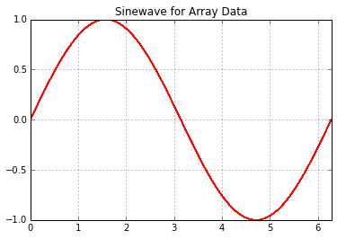
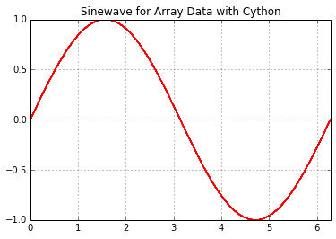

Cython -- A Transcompiler Language    
====================================

## Transform Your Python !!

### By James Bonanno, Central Ohio Python Presentation, March 2015

There are many cases where you simply want to get speed up an existing Python design, and in particular code in Python to get things working, then optimize (yes, early optimization is the root of all evil, but it's even **more sinister** if you run out of ways to optimize your code.)

What is is good for?

  - for making Python faster,
  - for making Python faster in an easy way
  - for wrapping external C and C++ 
  - making Python accessible to C and C++ (going the other way)
  
#### This presentation seeks primarily to discuss ways to transform your Python code and use it in a Python project. 
    

    
### References 

The new book by Kurt Smith is well written, clear in explanations, and the best overall treatment of Cython out there. An excellent book !! The book by Gorelick and Ozsvald is a good treatment, and it compares different methods of optimizing python including Shedskin, Theano, Numba, etc. 

1] Kurt W. Smith **Cython, A Guide for Python Programmers**, O'Reilly, January 2015

2] Mich Gorelick & Ian Ozsvald  **High Performance Python -- Practical Performant Programming for Humans** O'Reilly September 2014 

3] David Beazley and Brian K Jones, **Python Cookbook**, 3rd Edition, Printed May 2013, O'Reilly -- Chapter 15, page 632


### Why CYTHON?


It's more versatile than all the competition and has a manageable syntax. I hihgly recommend Kurt Smith's book on Cython. It's thorough, and if you read chapter 3, you will take in the essence of working with Cython functions. ***

Make sure to check out the new, improved documentation for Cython at:

http://docs.cython.org/index.html

This presentation will focus on using Cython to speed up Python functions, with some attention also given to arrays and numpy. There are more sophisticated treatments of using dynamically allocated memory, such as typically done with C and C++. 

A good link on memory allocation, where the heap is used with malloc():

http://docs.cython.org/src/tutorial/memory_allocation.html?highlight=numpy


## Getting Started:: Cython function types...


You must use "cdef" when defining a type inside of a function. For example, 

```python
def quad(int k):
    cdef int index = 0
    while index < k:
        return index**2
```  

People often get confused when using def, cdef, and cpdef.

The key factors are

  + def is importable into python
  + cdef is importable into C, but not python
  + cpdef is importable into both 

## Getting Started:: *Cythonizing* a Python function 


Now, if you were going to put pure cython code into action within your editor, say Wing IDE 
or PyCharm, you would want to define something like this in a file say for example ** cy_math.pyx **

Now, let's start with the familiar Fibonacci series ...
    
```python    
import cython 

def cy_fib(int n):
    """Print the Fibonacci series up to n."""
    cdef int a = 0 
    cdef int b = 1
    cdef int index = 0 
    while b < n:
        print ("%d, %d, \n" % (index, b) ) 
        a, b   = b, a + b
        index += 1

```        

## Getting Started:: A Distutils setup.py  ...


```python
from distutils.core import setup, Extension 
from Cython.Build import cythonize

#=========================================
# Setup the extensions
#=========================================
sources = [ "cyMath.pyx", "helloCython.pyx","cy_math.pyx", "bits.pyx", "printString.pyx"]

for fileName in sources:
    setup(ext_modules=cythonize(str(fileName)))

or...

map(lambda fileName : setup(ext_modules=cythonize(str(fileName))), sources)
```


    %%file helloCython.pyx
    
    import cython
    import sys 
    
    def message():
        print(" Hello World ....\n")
        print(" Hello Central Ohio Python User Group ...\n")
        print(" The 614 > 650::True")
        print(" The Python version is %s" % sys.version)
        print(" The Cython version is %s" % cython.__version__)
        print(" I hope that you learn something useful . . . .")
        
    def main():
        message()

    Overwriting helloCython.pyx


    %%file cyMath.pyx
    
    import cython
    
    def cy_fib(int n):
        """Print the Fibonacci series up to n."""
        cdef int a = 0 
        cdef int b = 1
        cdef int index = 0 
        while b < n:
            print ("%d, %d, \n" % (index, b) ) 
            a, b   = b, a + b
            index += 1


    Overwriting cyMath.pyx


    %%file printString.pyx
    
    import cython
    
    def display(char *bytestring):
        """ Print out a bytestring byte by byte. """  
    
        cdef char byte 
        
        for byte in bytestring:
                print(byte)  

    Overwriting printString.pyx


    %%file bits.pyx
    
    import cython
    
    def cy_reflect(int reg, int bits):
        """ Reverse all the bits in a register. 
            reg     = input register
            r       = output register 
        """
        cdef int x
        cdef int y
        cdef int r 
        x = 1 << (bits-1)
        y = 1 
        r = 0
        while x:
                if reg & x:
                    r |= y
                x = x >> 1
                y = y << 1
        return r 
            
    
    def reflect(self,s, bits=8):
        """ Take a binary number (byte) and reflect the bits. """
        x = 1<<(bits-1)
        y = 1
        r = 0
        while x:
                if s & x:
                        r |= y
                x = x >> 1
                y = y << 1
        return r

    Overwriting bits.pyx


    %%file setup.py
    
    from distutils.core import setup, Extension 
    from Cython.Build import cythonize
    
    #=========================================
    # Setup the extensions
    #=========================================
    sources = [ "cyMath.pyx", "helloCython.pyx",
               "cy_math.pyx", "bits.pyx", 
               "printString.pyx"]
    
    #for fileName in sources:
    #    setup(ext_modules=cythonize(str(fileName)))
    
    map(lambda fileName : setup(ext_modules=cythonize(str(fileName))), sources)

    Overwriting setup.py


    !python setup.py build_ext --inplace

    Compiling cyMath.pyx because it changed.
    Cythonizing cyMath.pyx
    running build_ext
    building 'cyMath' extension
    x86_64-linux-gnu-gcc -pthread -fno-strict-aliasing -DNDEBUG -g -fwrapv -O2 -Wall -Wstrict-prototypes -fPIC -I/usr/include/python2.7 -c cyMath.c -o build/temp.linux-x86_64-2.7/cyMath.o
    x86_64-linux-gnu-gcc -pthread -shared -Wl,-O1 -Wl,-Bsymbolic-functions -Wl,-Bsymbolic-functions -Wl,-z,relro -fno-strict-aliasing -DNDEBUG -g -fwrapv -O2 -Wall -Wstrict-prototypes -D_FORTIFY_SOURCE=2 -g -fstack-protector --param=ssp-buffer-size=4 -Wformat -Werror=format-security build/temp.linux-x86_64-2.7/cyMath.o -o /home/james/public_sw/CythonBootstrap/cyMath.so
    Compiling helloCython.pyx because it changed.
    Cythonizing helloCython.pyx
    running build_ext
    building 'helloCython' extension
    x86_64-linux-gnu-gcc -pthread -fno-strict-aliasing -DNDEBUG -g -fwrapv -O2 -Wall -Wstrict-prototypes -fPIC -I/usr/include/python2.7 -c helloCython.c -o build/temp.linux-x86_64-2.7/helloCython.o
    x86_64-linux-gnu-gcc -pthread -shared -Wl,-O1 -Wl,-Bsymbolic-functions -Wl,-Bsymbolic-functions -Wl,-z,relro -fno-strict-aliasing -DNDEBUG -g -fwrapv -O2 -Wall -Wstrict-prototypes -D_FORTIFY_SOURCE=2 -g -fstack-protector --param=ssp-buffer-size=4 -Wformat -Werror=format-security build/temp.linux-x86_64-2.7/helloCython.o -o /home/james/public_sw/CythonBootstrap/helloCython.so
    running build_ext
    Compiling bits.pyx because it changed.
    Cythonizing bits.pyx
    running build_ext
    building 'bits' extension
    x86_64-linux-gnu-gcc -pthread -fno-strict-aliasing -DNDEBUG -g -fwrapv -O2 -Wall -Wstrict-prototypes -fPIC -I/usr/include/python2.7 -c bits.c -o build/temp.linux-x86_64-2.7/bits.o
    x86_64-linux-gnu-gcc -pthread -shared -Wl,-O1 -Wl,-Bsymbolic-functions -Wl,-Bsymbolic-functions -Wl,-z,relro -fno-strict-aliasing -DNDEBUG -g -fwrapv -O2 -Wall -Wstrict-prototypes -D_FORTIFY_SOURCE=2 -g -fstack-protector --param=ssp-buffer-size=4 -Wformat -Werror=format-security build/temp.linux-x86_64-2.7/bits.o -o /home/james/public_sw/CythonBootstrap/bits.so
    Compiling printString.pyx because it changed.
    Cythonizing printString.pyx
    running build_ext
    building 'printString' extension
    x86_64-linux-gnu-gcc -pthread -fno-strict-aliasing -DNDEBUG -g -fwrapv -O2 -Wall -Wstrict-prototypes -fPIC -I/usr/include/python2.7 -c printString.c -o build/temp.linux-x86_64-2.7/printString.o
    x86_64-linux-gnu-gcc -pthread -shared -Wl,-O1 -Wl,-Bsymbolic-functions -Wl,-Bsymbolic-functions -Wl,-z,relro -fno-strict-aliasing -DNDEBUG -g -fwrapv -O2 -Wall -Wstrict-prototypes -D_FORTIFY_SOURCE=2 -g -fstack-protector --param=ssp-buffer-size=4 -Wformat -Werror=format-security build/temp.linux-x86_64-2.7/printString.o -o /home/james/public_sw/CythonBootstrap/printString.so


    import helloCython
    helloCython.message()


     Hello World ....
    
     Hello Central Ohio Python User Group ...
    
     The 614 > 650::True
     The Python version is 2.7.6 (default, Mar 22 2014, 22:59:56) 
    [GCC 4.8.2]
     The Cython version is 0.20.1post0
     I hope that you learn something useful . . . .


    import cyMath
    cyMath.cy_fib(100)

    0, 1, 
    
    1, 1, 
    
    2, 2, 
    
    3, 3, 
    
    4, 5, 
    
    5, 8, 
    
    6, 13, 
    
    7, 21, 
    
    8, 34, 
    
    9, 55, 
    
    10, 89, 
    


    import bits
    from bits import cy_reflect
    hexlist = [int(0x01),int(0x02),int(0x04),int(0x08)]
    [hex(cy_reflect(item,8)) for item in hexlist]


    ['0x80', '0x40', '0x20', '0x10']


    import printString
    printString.display('123')

    49
    50
    51


    # A little list comprehension here ...
    # A comparative method to the Cython printString function
    
    numberList = [1,2,3]
    [ord(str(value)) for value in numberList]


    [49, 50, 51]


### Now let's see the time difference between a cyfib and pyfib ...

----------------------


    %%file cyFib.pyx
    def cyfib(int n):
        cdef int a = 0
        cdef int b = 1
        cdef int index = 0
        while b < n:
            a, b = b, a+b
            index += 1
        return b

    Overwriting cyFib.pyx


# Introducing runcython !!

* Is located on Github
* Easy installation == pip install runcython
* Russell91 on Github 

https://github.com/Russell91/runcython

There is a runcython and makecython function calls . . . . .


    !makecython cyFib.pyx


    def pyfib(n):
        a = 0
        b = 1
        index = 0
        while b < n:
            a, b = b, a+b
            index += 1
        return b


    %timeit pyfib(1000)

    The slowest run took 5.33 times longer than the fastest. This could mean that an intermediate result is being cached 
    1000000 loops, best of 3: 940 ns per loop


    import cyFib
    %timeit cyFib.cyfib(1000)

    10000000 loops, best of 3: 61.8 ns per loop


### NOW THAT IS A CONSIDERABLE SPEEDUP  ... 

------

Fibonnaci function shows a factor of over **1500 %** Improvement

Let's take a look at disassembly for some reasons for this ....


    import dis 
    dis.dis(pyfib)

      2           0 LOAD_CONST               1 (0)
                  3 STORE_FAST               1 (a)
    
      3           6 LOAD_CONST               2 (1)
                  9 STORE_FAST               2 (b)
    
      4          12 LOAD_CONST               1 (0)
                 15 STORE_FAST               3 (index)
    
      5          18 SETUP_LOOP              43 (to 64)
            >>   21 LOAD_FAST                2 (b)
                 24 LOAD_FAST                0 (n)
                 27 COMPARE_OP               0 (<)
                 30 POP_JUMP_IF_FALSE       63
    
      6          33 LOAD_FAST                2 (b)
                 36 LOAD_FAST                1 (a)
                 39 LOAD_FAST                2 (b)
                 42 BINARY_ADD          
                 43 ROT_TWO             
                 44 STORE_FAST               1 (a)
                 47 STORE_FAST               2 (b)
    
      7          50 LOAD_FAST                3 (index)
                 53 LOAD_CONST               2 (1)
                 56 INPLACE_ADD         
                 57 STORE_FAST               3 (index)
                 60 JUMP_ABSOLUTE           21
            >>   63 POP_BLOCK           
    
      8     >>   64 LOAD_FAST                2 (b)
                 67 RETURN_VALUE        


    import cProfile
    cProfile.run('pyfib(1000)')

             3 function calls in 0.000 seconds
    
       Ordered by: standard name
    
       ncalls  tottime  percall  cumtime  percall filename:lineno(function)
            1    0.000    0.000    0.000    0.000 <ipython-input-14-58766c9dec61>:1(pyfib)
            1    0.000    0.000    0.000    0.000 <string>:1(<module>)
            1    0.000    0.000    0.000    0.000 {method 'disable' of '_lsprof.Profiler' objects}
    
    


### Another Example, with a polynomial this time ...

----

For now, lets begin with a polynomial function, and compare how to do this in python and cython! ....

Now consider a function such as 

$f(x) = a_0x^n + a_1x^{(n-1)} + a_2x^{(n-2)} ..... a_nx^0$ 

where in the case below n is selected as 2, and 
  - $a_0 = 0.1$, 
  - $a_1=0.5$
  - $a_2=0.25$. 
  
The cython function to do this called "cypoly" while the python version is called "pypoly". Each function is defined with a functional programming techinque of lambda and map, as shown below. 


    %%file cyPoly.pyx
    def cypoly(int n, int k):
        map(lambda x:(1.0*x**2 + 0.5*x + 0.25*x), range(k))

    Overwriting cyPoly.pyx


    !makecython cyPoly.pyx


    def pypoly(n,k):
        map(lambda x:.1*x**2 + .5*x + 0.25*x, range(k))

Now to compare the two ....


    import cyPoly
    %timeit cyPoly.cypoly(4,5000)
    %timeit pypoly(4,5000)

    1000 loops, best of 3: 745 µs per loop
    1000 loops, best of 3: 1.32 ms per loop


### Now's lets do something graphically, like plot a trig function. Let's also use a float/double type. 


    %%file sineWave.pyx
    import cython 
    from libc.math cimport sin
    
    def sinewave(double x):
        """ Calculate a sinewave for specified number of cycles, Ncycles, at a given frequency."""
        return sin(x)
        
        

    Overwriting sineWave.pyx


    !makecython sineWave.pyx


    import sineWave
    import math
    angle90 = math.pi/2
    sineWave.sinewave(angle90)


    1.0


### Now let's looking a data that involves arrays, and look at both python and numpy versions as well. 


    %matplotlib inline
    import matplotlib
    
    import matplotlib as plt
    import numpy as np
    
    x = np.linspace(0,2*np.pi,2000)
    %timeit plot(x,np.sin(x),'r')
    
    ## %timeit plot(x,sineWave.sinewave(x),'r') <== Why is this a problem ?? 
    
    xlim(0,6.28)
    title('Sinewave for Array Data')
    grid(True)

    The slowest run took 48.31 times longer than the fastest. This could mean that an intermediate result is being cached 
    1000 loops, best of 3: 771 µs per loop





    %%file myFunc.pyx
    
    import cython
    import numpy as np
    cimport numpy as np
    
    @cython.boundscheck(False)
    @cython.wraparound(False)
    def myfunc(np.ndarray[double, ndim=1] A):
        return np.sin(A)

    Overwriting myFunc.pyx


    !makecython myFunc.pyx

    In file included from /usr/include/python2.7/numpy/ndarraytypes.h:1761:0,
                     from /usr/include/python2.7/numpy/ndarrayobject.h:17,
                     from /usr/include/python2.7/numpy/arrayobject.h:4,
                     from myFunc.c:352:
    /usr/include/python2.7/numpy/npy_1_7_deprecated_api.h:15:2: warning: #warning "Using deprecated NumPy API, disable it by " "#defining NPY_NO_DEPRECATED_API NPY_1_7_API_VERSION" [-Wcpp]
     #warning "Using deprecated NumPy API, disable it by " \
      ^


    %matplotlib inline
    import matplotlib
    
    import myFunc
    import cython
    import numpy as np
    
    x = np.linspace(0,2*np.pi,2000)
    y = myFunc.myfunc(x)
    
    %timeit plot(x,y,'r')
    
    xlim(0,6.28)
    title('Sinewave for Array Data with Cython')
    grid(True)

    The slowest run took 40.88 times longer than the fastest. This could mean that an intermediate result is being cached 
    1000 loops, best of 3: 707 µs per loop





# Summary & Conclusions 

This talk has presented the basics of getting started with Cython and IPython/Jupyter Notebook. There were examples presented on how to compile Cython programs with a setup.py and distuils as well as a nice application, runcython. Basic programs and some programs with arrays were demonstrated.

Cython is flexible, and it's flexibility is matched by it's performance.

It's realitively easy to use, but it does have some details to watch out for when working with arrays, references, etc.

Overall

 - Cython enables Python code to be transformed easily
 - The transformed Python code is signficantly faster
 - Wide support and documentation exists for Cython
 - Language has evolved and grown over the past few years with widespread support
 - Usage in Ipython Notebook / Jupyter is now well supported
 - Can be used on a wide variety of programs, ranging from math to logic.
 
**Transform your Python with Cython !! **

